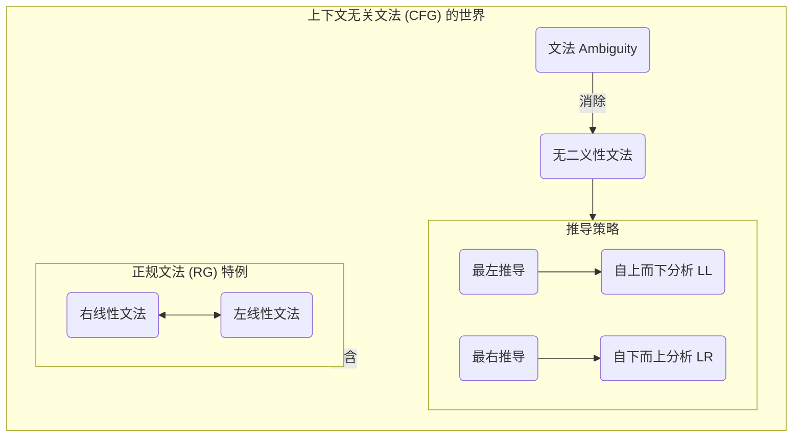

### <a name="toc"></a>语法分析：自上而下篇 - 知识点索引

*   [**第一讲：语法分析器的角色与挑战**](#lecture1-role-and-challenges)
    *   [1.1 语法分析器的核心任务](#1-1-parser-task)
        *   `语法分析器 (Parser)`
        *   `Token 序列`
        *   `上下文无关文法 (CFG)`
        *   `分析树 (Parse Tree)`
        *   `抽象语法树 (AST)`
        *   `语法错误 (Syntax Error)`
    *   [1.2 自上而下分析的核心思想](#1-2-top-down-idea)
        *   `自上而下 (Top-Down)`
        *   `推导 (Derivation)`
        *   `最左推导 (Leftmost Derivation)`
    *   [1.3 自上而下分析的“三大拦路虎”](#1-3-top-down-problems)
        *   `选择困境`
        *   `回溯 (Backtracking)`
        *   `左递归 (Left Recursion)`
        *   `ε-产生式 (Epsilon Production)`
    *   [1.4 知识串联](#1-4-remember)

*   [**第二讲：LL(1)文法 —— 打造“精准导航”的语法规则**](#lecture2-ll1-grammar)
    *   [2.1 目标：预测分析器](#2-1-predictive-parser)
        *   `预测分析 (Predictive Parsing)`
        *   `非回溯分析`
    *   [2.2 解决方案一：消除左递归](#2-2-eliminate-left-recursion)
        *   `直接左递归 (Immediate Left Recursion)`
        *   `间接左递归 (Indirect Left Recursion)`
        *   `消除左递归的标准公式`
    *   [2.3 解决方案二：提取左因子](#2-3-left-factoring)
        *   `公共前缀 (Common Prefix)`
        *   `提取左因子的标准公式`
    *   [2.4 预测的“水晶球”：FIRST 集与 FOLLOW 集](#2-4-first-follow-sets)
        *   `FIRST(α)`
        *   `FOLLOW(A)`
        *   `可空非终结符 (Nullable Non-terminal)`
        *   `FIRST 集的计算规则`
        *   `FOLLOW 集的计算规则`
    *   [2.5 LL(1) 文法的最终定义](#2-5-ll1-definition)
        *   `LL(1) 分析条件`
        *   `L: Left-to-right scan`
        *   `L: Leftmost derivation`
        *   `1: 1 token lookahead`
     
   *   [2.6 承上启下：自上而下分析的问题诊断与解决方案](#2-6-conclusion)

*   [**第三讲：两种主流的 LL(1) 分析器实现**](#lecture3-ll1-implementations)
    *   [3.1 方案一：递归下降分析](#3-1-recursive-descent)
        *   `核心思想：一个非终结符 → 一个函数`
        *   `构造方法`
        *   `优缺点`
        *   [3.1.1 扩充的BNF](#3-1-1-ebnf)   
    *   [3.2 方案二：表驱动的预测分析](#3-2-table-driven)
        *   `三大组件`
            *   `输入缓冲区`
            *   `分析栈 (Parsing Stack)`
            *   `预测分析表 (Parsing Table M)`
        *   `工作原理与算法`
            *   `匹配 (Match)`
            *   `推导 (Predict/Expand)`
            *   `接受 (Accept)`
            *   `报错 (Error)`
        *   [3.2.1 预测分析表的构造](#3-2-1-build-parsing-table)
            *   `构造算法`
            *   `利用 FIRST 集填充`
            *   `利用 FOLLOW 集处理 ε-产生式`
            *   `冲突 (Conflict)`

*   [**第四讲：错误处理与总结**](#lecture4-error-handling-summary)
    *   [4.1 错误恢复策略](#4-1-error-recovery)
        *   `恐慌模式 (Panic Mode)`
        *   `同步符号 (Synchronizing Tokens)`
        *   `利用 FOLLOW 集和 FIRST 集寻找同步点`
        *   `短语级别恢复 (Phrase-level Recovery)`
    *   [4.2 自上而下分析总结](#4-2-top-down-summary)
        *   `优点 (简单、直观、易于手写)`
        *   `缺点 (文法限制较多)`
        *   `展望：为何需要自下而上分析`

---

### 第一讲：语法分析器的角色与挑战 <a name="lecture1-role-and-challenges"></a>

[返回目录](#toc)

#### 1. 语法分析器的功能：从“单词”到“句子结构”<a name="1-1-parser-task"></a>

[返回目录](#toc)

想象一下，**词法分析器**刚刚完成了它的工作。它把一长串源代码字符流，切分成了一个个有意义的“单词”（**Token**）。

例如，源代码 `if (x > 0) y = 1;`
经过词法分析后，变成了这样一个 Token 序列：
`[IF]` `[LPAREN]` `[ID, "x"]` `[GT]` `[NUM, "0"]` `[RPAREN]` `[ID, "y"]` `[ASSIGN]` `[NUM, "1"]` `[SEMICOLON]`

**语法分析器 (Parser) 的核心任务是什么？**

它的任务就是接收这个 Token 序列，然后根据**语言的语法规则 (上下文无关文法)**，检查这些单词是否能构成一个**结构正确**的“句子”。

换句话说，它要回答的问题是：**“这串单词，能组成一句合法的 C 语言/Java/Python 语句吗？”**

*   **如果能**，语法分析器就会在内存中构建一个能反映其语法结构的**分析树 (Parse Tree)** 或更常用的**抽象语法树 (Abstract Syntax Tree, AST)**。这棵树就是后面阶段（语义分析、代码生成）的工作基础。
*   **如果不能**，它就会报告一个**语法错误 (Syntax Error)**，比如“`if` 后面缺少左括号”、“分号放错了位置”等等。

**所以，语法分析器是编译器的“结构工程师”或“语法警察”。**

---

#### 2. 自上而下分析：一种充满“预见性”的分析方法<a name="1-2-top-down-idea"></a>

[返回目录](#toc)

现在，我们知道了语法分析器要做什么，那么该**怎么做**呢？

**自上而下 (Top-Down)** 分析法是一种非常直观的策略。

*   **核心思想**：从文法的**开始符号 `S`** (最顶层的语法概念，比如“程序”或“语句”) 出发，尝试**推导出**我们在输入端看到的那个 Token 序列。
*   **一个比喻**：就像一个侦探，他有一个总的猜想：“这一定是一起谋杀案”（开始符号 `S`）。然后他根据规则（文法产生式）不断细化他的猜想：“如果是谋杀案，那就需要有作案动机、作案手法、凶器...” ( `S → 动机 手法 凶器` )。他一步步地将高层概念，分解成更低层的具体概念，直到最终的细节能和现场的证据（输入的 Token）完全匹配。

这个过程，实际上就是在**从根节点开始，预先构造出分析树**的过程。

---

#### 3. 自上而下分析面临的巨大挑战 (The Problems)<a name="1-3-top-down-problems"></a>

[返回目录](#toc)

这种“预言式”的分析方法听起来很美好，但在实践中，它立刻会遇到几个致命的问题，导致它变得**不确定、低效，甚至会陷入死循环**。

这就是 4.2 节的核心内容，也是我们下一讲要重点解决的问题。

**挑战一：选择的困境 (The Choice Problem)**

*   **问题描述**：当一个非终结符 `A` 有多个产生式选项时，比如 `A → α | β`，分析器在看到当前的输入 Token `t` 时，**应该选择哪个选项（`α` 还是 `β`）** 来继续推导呢？
    *   例如，对于语句 `stmt`，文法可能是 `stmt → if_stmt | for_stmt | assign_stmt`。如果当前 Token 是 `[IF]`，选择很明显。但如果文法设计得不好，选择可能就会变得模糊。
*   **原始的解决方法**：**回溯 (Backtracking)**。随便选一个（比如 `α`），然后顺着这条路走下去。如果发现后面的 Token 对不上了，就“退回来”，擦掉刚才做的所有工作，再尝试另一个选项 `β`。
*   **缺点**：极其低效！就像走迷宫，每次都走到死胡同再从头再来，这对于需要处理数百万行代码的编译器来说是不可接受的。

**挑战二：左递归的诅咒 (The Curse of Left Recursion)**

*   **问题描述**：如果文法中存在**直接左递归** (`A → Aα`) 或**间接左递归** (`A → B...`, `B → A...`)。
*   **致命后果**：自上而下的分析器会陷入**无限循环**！
    *   分析器想推导 `A`。
    *   它选择规则 `A → Aα`。
    *   为了推导新的 `A`，它又选择了规则 `A → Aα`...
    *   这个过程永远不会消耗任何输入 Token，也永远不会结束。分析器直接崩溃。

**挑战三：空产生式的麻烦 (The Trouble with ε-Productions)**

*   **问题描述**：当存在 `A → ε` 这样的规则时。
*   **后果**：
    1.  它加剧了**选择的困境**。分析器在任何时候都可以“假装”推导出了一个 `A`，但实际上什么都没匹配。
    2.  它可能与左递归结合，导致更隐蔽的无限循环。

---
### 4. 知识串联<a name="1-4-remember"></a>

[返回目录](#toc)

**第一部分：左递归与ε-产生式 —— 自上而下分析的噩梦**

让我们用一个具体的**推导过程模拟**，来直观地感受一下灾难是如何发生的。

假设我们的分析器是一个非常“实在”的程序，它的工作方式是：
> “要推导一个非终-结符 `A`，我就调用一个名为 `parse_A()` 的函数。”

#### 场景一：直接左递归的诅咒

*   **文法**: `E → E + T | T`
*   **输入**: `id + id`
*   **分析过程**:
    1.  **`main()`** 调用 **`parse_E()`**，目标是匹配 `id + id`。
    2.  **`parse_E()`** 开始工作。它看到了 `E` 的第一条规则 `E → E + T`。
    3.  **`parse_E()`** 说：“好的，为了推导出 `E`，我需要先推导出规则右边的第一个东西，也就是... **`E`**！”
    4.  于是，**`parse_E()`** 为了完成自己的任务，**再一次调用了它自己 `parse_E()`**！
    5.  新的 **`parse_E()`** 开始工作，它看到了第一条规则 `E → E + T`...
    6.  它又一次调用了 **`parse_E()`**...
    7.  ...

*   **灾难发生**：这个过程形成了一个**无限的函数递归调用** `parse_E() -> parse_E() -> parse_E() -> ...`。
*   **根本原因**：在整个无限循环中，分析器**没有消耗掉任何一个输入 Token** (`id`)。它的目光始终停留在第一个 `id` 上，但推导过程却在原地打转，永远无法前进。最终结果就是**栈溢出 (Stack Overflow)**，程序崩溃。

#### 场景二：ε-产生式的麻烦

ε-产生式本身不一定是坏事，但它会极大地增加**不确定性**，让分析器“疑神疑鬼”。

你提的这个问题非常精准，直接点出了 **ε-产生式是如何让“选择困难”变得更加复杂和隐蔽的**。你对第一种情况的理解完全正确，现在我们来深入剖etc你不太理解的第二种情况。

---

### 解析第二种情况：`A→Bx`, `B→x|ε`

我们先把你例子中的描述语言“某一右部推导出现空串”翻译成更精确的说法，它指的是：
> 对于同一个非终结符 `A`，它的**某条**产生式 `A → α` 的开头部分 `FIRST(α)`，和**另一条**产生式 `A → β` 的开头部分 `FIRST(β)`，**产生了交集**。而这个交集的产生，**是由于其中某一条规则（比如 `α`）里包含了一个可以变为空的非终-结符**。

让我们用你的例子来模拟一下这个困境。

*   **文法**:
    1.  `A → B x`
    2.  `A → y`  (为了对比，我们给 A 加一个明显不同的选项)
    3.  `B → x | ε`

*   **输入**: `x`

*   **分析器的视角 (在需要推导 `A` 时)**:
    1.  分析器当前需要推导 `A`，它手头的下一个输入 Token 是 `x`。
    2.  它开始检查 `A` 的所有选项，看看哪个是可能的“正确道路”。它会计算每个选项的 `FIRST` 集。
        *   **选项1 (`A → Bx`)**:
            *   `FIRST(Bx)` 是什么？我们需要看 `FIRST(B)`。
            *   `FIRST(B)` = `FIRST(x) ∪ FIRST(ε)` = `{x, ε}`。
            *   因为 `B` **可以为空**，所以 `Bx` 的开头**既有可能**是 `B` 的开头 `x`，**也有可能**是 `B` “消失”后，暴露出来的 `x`。
            *   所以，`FIRST(Bx) = {x}`。
        *   **选项2 (`A → y`)**:
            *   `FIRST(y) = {y}`。

    3.  **好了，现在我们不看选项2，我们假设文法是 `A → Bx | x`**。
        *   `FIRST(Bx) = {x}`
        *   `FIRST(x) = {x}`
        *   **冲突发生！** `FIRST(Bx)` 和 `FIRST(x)` 的交集不是空集！

---
### 困境的根源：二义性的选择

现在，分析器站在推导 `A` 的岔路口，看着输入 `x`，它彻底糊涂了：

*   **可能性1**: “这个 `x` 是由 `A → Bx` 这条路产生的。具体来说，是 `B` 变成了 `ε`，然后我匹配了 `x`。” (推导路径: `A ⇒ Bx ⇒ εx ⇒ x`)

*   **可能性2**: “这个 `x` 也是由 `A → Bx` 这条路产生的。具体来说，是 `B` 变成了 `x`，然后... 咦，后面还需要一个 `x`，但输入没有了。这条路好像不对。” (推导路径: `A ⇒ Bx ⇒ xx`)

*   **可能性3 (如果我们文法是 `A -> Bx | x`)**: “这个 `x` 是由 `A → x` 这条路直接产生的。”

**这就是你说的“需要有预见性地绕过当前匹配的x”的困境的本质。** 分析器仅凭当前的输入 `x`，**无法确定**这个 `x` 到底是属于 `B` 的，还是属于 `A → Bx` 里那个独立的 `x` 的。

**你说的“即便存在ε也不会导致这种情况发生”也是完全正确的！**
*   比如文法是 `A → B c`, `B → d | ε`。
    *   `FIRST(Bc) = FIRST(B)` (因为B不空) ∪ `FIRST(c)` (因为B可空) = `{d, c}`。
    *   如果 `A` 的另一个选项是 `A → e`，`FIRST(e) = {e}`。
    *   `{d, c}` 和 `{e}` 的交集是空，**没有冲突**。分析器看到 `d` 或 `c` 就选 `A → Bc`，看到 `e` 就选 `A → e`。

**所以，问题的关键不在于“存在ε-产生式”，而在于“ε-产生式是否导致了不同选项的 FIRST 集重叠”。**


---

**第二部分：关键概念梳理**

这是一张帮你理清这些概念关系的“地图”。

#### 1. 核心目标：推导 (Derivation)

*   **推导**：从文法的开始符号 `S` 出发，通过反复应用产生式规则，最终得到一个只包含终结符的字符串（句子）的过程。
*   **分析 (Parsing)**：是推导的**逆过程**。给定一个句子，试图找到一条能推导出它的路径，并在此过程中构建分析树。

#### 2. 推导过程的两种“策略”

*   **最左推导 (Leftmost Derivation)**：在推导的每一步，**总是**选择当前字符串中**最左边**的那个非终结符进行替换。
    *   **这是所有自上而下分析法（包括LL）采用的策略。**
*   **最右推导 (Rightmost Derivation)**：在推导的每一步，**总是**选择当前字符串中**最右边**的那个非终结符进行替换。
    *   **这是所有自下而上分析法（包括LR）采用的策略。**
    *   最右推导的逆过程，被称为“规范规约 (Canonical Reduction)”。

#### 3. 文法的两种“家族”

*   **上下文无关文法 (CFG / 2型)**：这是我们的大本营。它的规则是 `A → β`。
*   **正规文法 (RG / 3型)**：这是一个特殊的、受限的 CFG 家族。
    *   **右线性文法 (RLG)**：规则是 `A → aB` 或 `A → a`。
    *   **左线性文法 (LLG)**：规则是 `A → Ba` 或 `A → a`。
    *   **关系**：RLG 和 LLG 的表达能力完全等价。你做的那道题，就是证明它们之间可以相互转换。它们都只能描述正规语言，无法处理嵌套。

#### 4. 文法的一个“坏属性”：二义性 (Ambiguity)

*   **什么是二义性文法？**
    *   如果一个文法，对于**同一个句子**，存在**至少两棵不同**的分析树，那么这个文法就是二义性的。
    *   这通常意味着，对于同一个句子，存在**至少两条不同**的最左推导路径（或最右推导路径）。
*   **为什么它很坏？**
    *   因为分析树决定了代码的**含义（语义）**。两棵不同的树，可能意味着两种完全不同的计算方式。
    *   经典的例子：`E → E + E | E * E`。对于 `3 + 4 * 5`，可以构建出 `(3+4)*5` 和 `3+(4*5)` 两棵树。
*   **消除二义性**：
    *   通过**改写文法**，强制规定运算符的**优先级和结合性**。
    *   例如，引入新的非终结符 `T` 和 `F`，将文法改写为 `E -> E+T | T`, `T -> T*F | F`... 这就是我们做过的练习。

**总结关系图**



这张图告诉你：
*   我们的基础是 CFG。
*   我们要先消除它的**二义性**。
*   然后根据选择的**推导策略**（最左或最右），决定我们是走**自上而下**还是**自下而上**的分析路线。
*   而**正规文法**，只是 CFG 的一个能力较弱但特性很好的子集，主要用于词法分析。

---


### 第二讲：LL(1)文法 —— 打造“精准导航”的语法规则<a name="lecture2-ll1-grammar"></a>

[返回目录](#toc)

---

#### 2.1 我们的目标 —— 预测分析器<a name="2-1-predictive-parser"></a>

[返回目录](#toc)

在我们深入学习如何改造文法之前，我们必须先清晰地定义我们**最终想要建造的“机器”是什么样子的**。这个理想中的机器，就叫做**预测分析器 (Predictive Parser)**。

#### 1. 什么是预测分析器？

预测分析器是一种特殊的、高效的**自上而下**分析器。它“特殊”在以下几点：

*   **无回溯 (No Backtracking)**：
    *   这是它**最核心、最宝贵**的特性。
    *   当它面临选择时（比如 `A → α | β`），它**不需要**像无头苍蝇一样先试 `α`，不行再退回来试 `β`。
    *   相反，它能够“**预测**”未来，**一次性地、确定地**做出正确的选择。

*   **“预测”的依据是什么？**
    *   它的预测能力来自于一个简单的技巧：**向前看一个输入符号 (1 Token Lookahead)**。
    *   通过窥视紧跟在当前位置的**下一个** Token，它就能准确地知道接下来应该选择哪条产生式规则进行推导。

#### 2. 预测分析器的工作模型（一个简单的比喻）

想象你在一个岔路口，面前有两条路，分别通往“北京”和“上海”。

*   **一个需要回溯的笨方法**：
    1.  你不知道该走哪条，于是你猜了一条路（比如去“北京”的路）。
    2.  你开了一天车，发现路牌上写着“欢迎来到哈尔滨”，你知道走错了。
    3.  你不得不掉头，开一天车回到岔路口，再选择去“上海”的路。
    *   这就是**回溯**，它浪费了大量的时间和资源。

*   **预测分析器的方法**：
    1.  你站在岔路口，不急着开车。
    2.  你抬头看了一眼路牌。左边的路牌上画着“天安门”（`FIRST(北京之路)`），右边的路牌上画着“东方明珠”（`FIRST(上海之路)`）。
    3.  你掏出你的行程单（输入流），看到下一个目的地是“东方明珠”。
    4.  你**立刻、确定地**选择了右边的路。
    *   这就是**预测分析**。通过“向前看”路牌（`FIRST`集），你做出了一个**不可撤销的、正确的**决定。

#### 3. 为什么我们的目标是它？

1.  **高效 (Efficient)**：
    *   因为它从不走冤枉路，分析过程是**线性的**，时间复杂度与源代码的长度成正比 `O(n)`。这对于处理大型程序至关重要。
2.  **简单 (Simple)**：
    *   预测分析器的算法逻辑相对简单，无论是手写（递归下降）还是自动生成（表驱动），都易于实现和理解。
3.  **错误定位准确 (Good Error Locality)**：
    *   当它发现当前 Token 和预测的 Token 不符时，它能立即、准确地报告错误位置，并给出有用的提示（比如“此处期望一个分号，但看到了一个右括号”）。

#### 4. 我们面临的挑战

**“理想很丰满，现实很骨感。”**

这个高效的预测分析器，对它的“图纸”——也就是**文法**，提出了极高的要求。

*   **它不能容忍任何“模棱两可”的指示**。
*   如果文法有**左递归**，它的“GPS”会原地死机。
*   如果文法有**公共前缀**（未提取左因子），它站在岔路口会看到两边的路牌上都画着“收费站”，导致它无法选择。
*   如果文法设计不满足某些条件（我们后面学的 **LL(1) 条件**），它会发现某些路牌模糊不清，或者行程单上的目的地和所有路牌都不匹配。

**所以，我们接下来要学习的所有内容——消除左递归、提取左因子、计算 FIRST/FOLLOW 集、定义 LL(11) 条件——其**唯一**的、共同的目标，就是**将一个普通的、可能有问题的上下文无关文法，改造成一本能让“预测分析器”这部机器完美运行的、清晰无误的“导航手册”**。

---


#### 2.2 解决方案一：消除左递归<a name="2-2-eliminate-left-recursion"></a>

[返回目录](#toc)

左递归是自上而下分析器的天敌，我们必须彻底消灭它。

##### **情况一：直接左递归**

这是最常见、最明显的一种。

*   **形式**：`A → Aα | β`
    *   `Aα` 是**递归项** (它以 `A` 自身开头)。
    *   `β` 是**非递归项** (它不以 `A` 开头)。

*   **问题分析**：这个文法生成的语言是什么样的？
    *   它首先必须生成一个 `β`。
    *   然后，这个 `β` 后面可以跟着**零个或多个** `α`。
    *   所以，这个文法描述的语言，用正规式来类比就是 `β(α)*`。

*   **改造手术**：我们的目标，就是用**右递归**来重新表达 `β(α)*` 这个模式。
    1.  我们引入一个新的非终结符，通常叫 `A'` (读作 A-prime)。这个 `A'` 就代表了那个“可以重复零或多次的 `α` 序列”。
    2.  `A'` 如何生成 `(α)*`？用右递归：`A' → αA' | ε`。
    3.  原来的 `A` 怎么改？它现在只需要先生成一个 `β`，然后把生成 `(α)*` 的任务交给 `A'` 就行了。所以：`A → βA'`。

*   **消除直接左递归的标准公式**：
    > 对于产生式 `A → Aα₁ | Aα₂ | ... | Aαₘ | β₁ | β₂ | ... | βₙ`
    >
    > 将其改写为：
    >
    > **`A → β₁A' | β₂A' | ... | βₙA'`**
    > **`A' → α₁A' | α₂A' | ... | αₘA' | ε`**

*   **经典例子：算术表达式**
    *   **原始文法**: `E → E + T | T`
    *   **识别**: `A=E`, `α = +T`, `β = T`
    *   **套用公式**:
        *   `E → TE'`
        *   `E' → +TE' | ε`
    *   改造后的文法完全等价，且消除了左递归。

##### **情况二：间接左递归**

这是一种更隐蔽的左递归。

*   **形式**：`A → Bα | ...`，`B → Aβ | ...`
*   **问题分析**：推导 `A` 需要先推导 `B`，而推导 `B` 又需要先推导 `A`，形成了一个推导环，最终导致无限循环 `A ⇒ Bα ⇒ Aβα`。

*   **改造手术**：通过**代入法**，将间接左递归**暴露**成直接左递归，然后再用上面的公式消除。

*   **消除间接左递归的算法**：
    1.  将所有非终结符按一定顺序列出（例如 `A₁, A₂, ..., Aₙ`）。
    2.  `for i from 1 to n:`
        *   `for j from 1 to i-1:`
            *   把所有 `Aᵢ → Aⱼγ` 形式的规则，用 `Aⱼ` 的所有产生式 `Aⱼ → δ₁ | δ₂ | ...` 进行代入。
            *   代入后，`Aᵢ` 的规则就变成了 `Aᵢ → δ₁γ | δ₂γ | ...`，从而消除了对 `Aⱼ` 的依赖。
        *   **此时，`Aᵢ` 的所有规则中，如果还存在左递归，那一定是直接左递归。**
        *   使用上面的**标准公式**，消除 `Aᵢ` 的直接左递归。

*   **例子**：
    *   **原始文法**: `S → Aa | b`, `A → Sc | d`
    *   **识别**: 顺序是 S, A。
    *   **处理 S (i=1)**: `j` 循环为空，`S` 没有直接左递归。不变。
    *   **处理 A (i=2)**: `j=1`。
        *   把 `A` 的规则 `A → Sc | d` 中的 `S`，用 `S` 的规则 `S → Aa | b` 代入。
        *   `A → (Aa|b)c | d`
        *   展开得到：`A → Aac | bc | d`
        *   **看！间接左递归成功暴露成了直接左递归！**
    *   **消除 A 的直接左递归**:
        *   `A → bcA' | dA'`
        *   `A' → acA' | ε`

    *   **最终的无左递归文法是**:
        *   `S → Aa | b`
        *   `A → bcA' | dA'`
        *   `A' → acA' | ε`

---

#### 2.3 解决方案二：提取左因子<a name="2-3-left-factoring"></a>

[返回目录](#toc)

消除了左递归，我们解决了“死循环”的问题。但“选择困难”的问题依然存在。

*   **问题描述**：当一个非终结符的多个产生式选项，有**共同的前缀**时，分析器就不知道该选哪个。
    *   例如：`stmt → if expr then stmt | if expr then stmt else stmt`
    *   当分析器看到输入是 `if` 时，它无法决定是该用第一条规则还是第二条。

*   **改造手术**：把**公共的前缀（左因子）**提取出来，把不同的部分推迟到后面一个新的非终-结符里去决定。

*   **提取左因子的标准公式**：
    > 对于产生式 `A → αδ₁ | αδ₂ | ... | αδₙ | γ` (γ是不以α开头的其他选项)
    >
    > 将其改写为：
    >
    > **`A → αA' | γ`**
    > **`A' → δ₁ | δ₂ | ... | δₙ`**

*   **经典例子：if-else 语句**
    *   **原始文法**: `S → iEtS | iEtSeS` (用 `i,t,e` 代表 `if,then,else`)
    *   **识别**: 公共前缀 `α = iEtS`。不同的部分是 `ε` 和 `eS`。
    *   **套用公式**:
        *   `S → iEtSS'`
        *   `S' → eS | ε`
    *   改造后的文法，在看到 `if...then...stmt` 之后，可以通过一个新的非终结符 `S'`，来专门判断后面到底有没有 `else`。

---


#### 2.4 FIRST 集与 FOLLOW 集<a name="2-4-first-follow-sets"></a>

[返回目录](#toc)

**FIRST 集：一个产生式能“吐出”的第一个“单词”**

*   **定义**：对于任意的文法符号串 `α` (可以是单个符号，也可以是多个符号的组合)，`FIRST(α)` 是一个**终结符**的集合。这个集合包含了从 `α` **可能推导出的所有字符串**的**第一个终结符**。

*   **特殊情况**：如果 `α` 能够推导出空串 `ε`，那么 `ε` 也要加入到 `FIRST(α)` 中。

*   **直观理解**：`FIRST(A)` 就是在问：“**如果我要推导非终结符 `A`，我可能遇到的第一个实际的单词 (Token) 会是什么？**”

**如何计算 FIRST 集？**

这是一个迭代过程，直到集合不再变化为止。

1.  **对于单个终结符 `t`**:
    *   `FIRST(t) = {t}` (一个单词的开头就是它自己)。

2.  **对于单个非终结符 `X`**:
    *   遍历 `X` 的每一个产生式 `X → Y₁Y₂...Yₖ`。
    *   将 `FIRST(Y₁)` 中**除了 `ε` 之外**的所有符号，都加入 `FIRST(X)`。
    *   **如果** `FIRST(Y₁)` **包含** `ε`，那么就继续看 `FIRST(Y₂)`，把 `FIRST(Y₂)` 中除了 `ε` 的所有符号也加入 `FIRST(X)`。
    *   这个过程一直持续下去。如果 `Y₁`, `Y₂`, ..., `Yₖ` 的 FIRST 集都包含 `ε`，那么就把 `ε` 也加入 `FIRST(X)`。

3.  **对于字符串 `α = X₁X₂...Xₙ`**:
    *   计算方法与上面类似，从 `X₁` 开始，如果 `FIRST(X₁)` 含 `ε`，就合并 `FIRST(X₂)`，以此类推。

**例子** (我们消除左递归后的文法):
*   `E → TE'`
*   `E' → +TE' | ε`
*   `T → FT'`
*   `T' → *FT' | ε`
*   `F → (E) | id`

**计算结果**:
*   `FIRST(id) = {id}`
*   `FIRST('(') = {'('}`
*   `FIRST(F) = FIRST((E)) ∪ FIRST(id) = {'(', id}`
*   `FIRST(T') = FIRST(*FT') ∪ FIRST(ε) = {'*', ε}`
*   `FIRST(T) = FIRST(FT') = FIRST(F) = {'(', id}` (因为`FIRST(F)`不含`ε`)
*   `FIRST(E') = FIRST(+TE') ∪ FIRST(ε) = {'+', ε}`
*   `FIRST(E) = FIRST(TE') = FIRST(T) = {'(', id}`

---
**FOLLOW 集：一个非终结符后面能“紧跟”的“单词”**

*   **定义**：对于非终结符 `A`，`FOLLOW(A)` 是一个**终结符**的集合。这个集合包含了在推导过程中，**可能紧跟在 `A` 后面的**那些终结符。

*   **特殊情况**：如果 `A` 可能出现在某个推导句型的最末尾，那么**文件结束符 `$`** 也要加入到 `FOLLOW(A)` 中。

*   **直观理解**：`FOLLOW(A)` 就是在问：“**在我成功推导出 `A` 之后，我应该期望看到什么样的单词？**” 这个集合对于处理 `A → ε` 这种“隐形”推导至关重要。

---

### 目标：计算 FOLLOW(A)

**核心问题**: 对于一个非终结符 `A`，在任何合法的推导过程中，什么样的**终结符** `t` 可能会**紧跟在 `A` 的后面**？

**一个重要的预备概念**:
*   **可空 (Nullable)**：一个非终结符 `X` 是“可空的”，如果 `X` 能通过一步或多步推导出空串 `ε` (即 `ε ∈ FIRST(X)`)。在计算 FOLLOW 集之前，我们必须先计算出所有符号串的 FIRST 集，并确定哪些非终结符是可空的。

---

### FOLLOW 集的计算规则 

这是一个**迭代算法**。你需要反复应用以下三条规则，直到所有非终结符的 FOLLOW 集都不再增大为止。

**准备工作**：
1.  为每一个非终结符 `A`，创建一个空的集合 `FOLLOW(A)`。
2.  设 `S` 为文法的开始符号。

**三条黄金规则：**

#### 规则 1：为开始符号“播种”

> **将文件结束符 `$` 放入 `FOLLOW(S)` 中。**

*   **原因**：开始符号 `S` 代表了整个程序或句子。当整个句子成功推导完毕后，后面紧跟的就是输入的末尾，我们用 `$` 这个特殊的终结符来表示它。这是所有 FOLLOW 集计算的起点。

#### 规则 2：寻找“紧跟在后面”的终结符

> **遍历文法中的每一个产生式，寻找形如 `P → α A β` 的规则。**
>
> **然后，将 `FIRST(β)` 中所有<u>非 `ε`</u> 的符号，全部加入到 `FOLLOW(A)` 中。**

*   **α, β**：可以是任意文法符号串（终结符、非终结符、`ε`）。
*   **原因**：这个规则是最直观的。既然在产生式里，`β` 就写在 `A` 的后面，那么 `β` 能推导出的**第一个终结符**，自然就有可能紧跟在 `A` 的后面。
*   **为什么排除 `ε`**？因为 `ε` 不是一个实际的 Token，它代表“空”。如果 `β` 本身可以变为空，那么我们就需要考虑 `β` “消失”后，`A` 后面会跟什么。这就引出了下一条规则。

#### 规则 3：处理“末尾”和“可空”的情况

> **遍历文法中的每一个产生式，寻找形如 `P → α A` 或 `P → α A β` (其中 `β` 是可空的) 的规则。**
>
> **然后，将 `FOLLOW(P)` 中的所有符号，全部加入到 `FOLLOW(A)` 中。**

*   **原因**：这个规则处理的是“**传递性**”。
    *   在 `P → αA` 中，`A` 出现在产生式的最末尾。这意味着，任何能够跟在 `P` 后面的东西，现在也都能跟在 `A` 后面。
    *   在 `P → αAβ` 中，如果 `β` 有可能“消失”（变成 `ε`），那么 `A` 就会暴露出来，直接面对那些原本跟在 `P` 后面的符号。
    *   所以，在这些情况下，`P` 的“后继者”集合 `FOLLOW(P)`，也必须成为 `A` 的“后继者”集合的一部分。

---

### 实战演练：计算表达式文法的 FOLLOW 集

**文法**：
1.  `E → T E'`
2.  `E' → + T E' | ε`
3.  `T → F T'`
4.  `T' → * F T' | ε`
5.  `F → ( E ) | id`

**预计算的 FIRST 集和可空性**：
*   `FIRST(E) = FIRST(T) = FIRST(F) = { '(', id }`
*   `FIRST(E') = { '+', ε }`  =>  `E'` **是可空的**
*   `FIRST(T') = { '*', ε }`  =>  `T'` **是可空的**

**开始迭代计算 FOLLOW 集：**

**第 0 轮 (初始化)**:
*   `FOLLOW(E) = { $ }`  (根据规则1，E是开始符号)
*   `FOLLOW(E') = { }`
*   `FOLLOW(T)  = { }`
*   `FOLLOW(T') = { }`
*   `FOLLOW(F)  = { }`

**第 1 轮 (遍历所有产生式)**:

1.  `E → T E'`:
    *   `E'` 在 `T` 后面。应用**规则2**：将 `FIRST(E')` 中非 `ε` 的 `{+}` 加入 `FOLLOW(T)`。
        *   `FOLLOW(T) = { + }`
    *   `E'` 在产生式末尾，且 `E'` 是**可空的**。应用**规则3**：将 `FOLLOW(E)` 的 `{ $ }` 加入 `FOLLOW(T)`。
        *   `FOLLOW(T) = { +, $ }`
    *   `E'` 在产生式末尾。应用**规则3**：将 `FOLLOW(E)` 的 `{ $ }` 加入 `FOLLOW(E')`。
        *   `FOLLOW(E') = { $ }`

2.  `E' → + T E'`:
    *   `E'` 在 `T` 后面。应用**规则2**：`FIRST(E')` 的 `{+}` 加入 `FOLLOW(T)`。(已存在)
    *   `E'` 是可空的，将 `FOLLOW(E')` 加入 `FOLLOW(T)`。(已存在)
    *   `E'` 在末尾，将 `FOLLOW(E')` 加入 `FOLLOW(E')`。(集合不变)

3.  `T → F T'`:
    *   `T'` 在 `F` 后面。应用**规则2**：将 `FIRST(T')` 中非 `ε` 的 `{*}` 加入 `FOLLOW(F)`。
        *   `FOLLOW(F) = { * }`
    *   `T'` 是**可空的**。应用**规则3**：将 `FOLLOW(T)` 的 `{+, $}` 加入 `FOLLOW(F)`。
        *   `FOLLOW(F) = { *, +, $ }`
    *   `T'` 在末尾。应用**规则3**：将 `FOLLOW(T)` 的 `{+, $}` 加入 `FOLLOW(T')`。
        *   `FOLLOW(T') = { +, $ }`

4.  `T' → * F T'`: (类似 `E' → + T E'`)
    *   `T'` 在 `F` 后面。`FIRST(T')` 的 `{*}` 加入 `FOLLOW(F)`。(已存在)
    *   `T'` 可空，`FOLLOW(T')` 的 `{+, $}` 加入 `FOLLOW(F)`。(已存在)
    *   `T'` 在末尾，`FOLLOW(T')` 加入 `FOLLOW(T')`。(集合不变)

5.  `F → ( E )`:
    *   `)` 在 `E` 后面。应用**规则2**：将 `FIRST(')')` 的 `{)}` 加入 `FOLLOW(E)`。
        *   `FOLLOW(E) = { $, ) }`

**第 1 轮结束时的集合状态**：
*   `FOLLOW(E) = { $, ) }`
*   `FOLLOW(E') = { $ }`
*   `FOLLOW(T)  = { +, $ }`
*   `FOLLOW(T') = { +, $ }`
*   `FOLLOW(F)  = { *, +, $ }`

**第 2 轮 (再次遍历，检查是否有变化)**:

1.  `E → T E'`:
    *   `E'` 可空，将 `FOLLOW(E)` 的 `{$, )}` 加入 `FOLLOW(T)`。
        *   `FOLLOW(T)` 变为 `{ +, $, ) }` (**有变化!**)
    *   `E'` 在末尾，将 `FOLLOW(E)` 的 `{$, )}` 加入 `FOLLOW(E')`。
        *   `FOLLOW(E')` 变为 `{ $, ) }` (**有变化!**)
    *   ...
3.  `T → F T'`:
    *   `T'` 可空，将 `FOLLOW(T)` 的 `{+, $, )}` 加入 `FOLLOW(F)`。
        *   `FOLLOW(F)` 变为 `{ *, +, $, ) }` (**有变化!**)
    *   `T'` 在末尾，将 `FOLLOW(T)` 的 `{+, $, )}` 加入 `FOLLOW(T')`。
        *   `FOLLOW(T')` 变为 `{ +, $, ) }` (**有变化!**)

**第 2 轮结束时的集合状态**：
*   `FOLLOW(E) = { $, ) }`
*   `FOLLOW(E') = { $, ) }`
*   `FOLLOW(T)  = { +, $, ) }`
*   `FOLLOW(T') = { +, $, ) }`
*   `FOLLOW(F)  = { *, +, $, ) }`

**第 3 轮 (再次遍历)**:
*   你会发现，再用这三条规则去跑一遍，没有任何集合会再增添新的成员了。

**最终结果 (算法收敛)**:
*   `FOLLOW(E) = { $, ) }`
*   `FOLLOW(E') = { $, ) }`
*   `FOLLOW(T) = { +, $, ) }`
*   `FOLLOW(T') = { +, $, ) }`
*   `FOLLOW(F) = { *, +, $, ) }`


---
#### 2.5 LL(1) 文法的最终定义<a name="2-5-ll1-definition"></a>

[返回目录](#toc)

现在我们有了“水晶球” FIRST 集和 FOLLOW 集，终于可以给出一个**精确的、可操作的**判断标准了。

一个文法是 **LL(1)** 文法，**当且仅当**，对于该文法的**每一个**非终结符 `A` 的**任何两个**不同的产生式 `A → α` 和 `A → β`，都满足以下两个条件：

**条件一：不同选项的开头不能相同。**
> `FIRST(α)` 和 `FIRST(β)` 的**交集为空** (`∩ = ∅`)。
>
> **例外**：如果其中一个（比如`α`）可以推导出 `ε`，这个条件可以放宽。
>
> **直观理解**：如果两条路都可能以 `if` 开头，那么当我看到 `if` 时，我就不知道该走哪条路了。

**条件二：如果某个选项可能为空，那么它的后继也不能是其他选项的开头。**
> 如果 `FIRST(α)` 包含 `ε`，那么 `FOLLOW(A)` 和 `FIRST(β)` 的**交集必须为空** (`∩ = ∅`)。
>
> **直观理解**：假设 `A → ε | id`。如果 `A` 后面可能跟着 `id` (即 `id ∈ FOLLOW(A)`), 那么当我看到输入是 `id` 时，我到底是该用 `A → id` 去匹配它呢，还是该用 `A → ε` “悄悄溜过去”，让后面的语法结构去匹配它呢？这就产生了**二义性**。

**LL(1) 名称的含义：**
*   **第一个 L**: 从**左** (Left) 到右扫描输入。
*   **第二个 L**: 产生**最左** (Leftmost) 推导。
*   **括号里的 1**: 在做每一个决定时，只需要**向前看 1 个** Token。

---


#### 2.6 承上启下：自上而下分析的问题诊断与解决方案<a name="2-6-conclusion"></a>

[返回目录](#toc)

**我们的起点**：我们想构建一个高效的、自上而下的**预测分析器**。

**我们面临的现实**：一个随手写出的上下文无关文法，几乎都存在一些“先天疾病”，会让我们的预测分析器“生病”（陷入死循环或选择困难）。

本节的目标，就是像一个医生一样，学会**诊断**这些疾病，并掌握对应的**治疗方案**。

---

#### **疾病一：左递归 (Left Recursion)**

*   **症状 (Symptom)**:
    *   分析器在推导 `A` 的过程中，第一个任务又是推导 `A`，导致**无限递归**和**栈溢出**。分析器无法消耗任何输入，原地“猝死”。

*   **如何诊断 (Diagnosis)**:
    1.  **直接左递归**: 眼睛就能看出来。寻找形如 `A → Aα` 的产生式。
    2.  **间接左递归**: 需要系统性排查。寻找推导环，如 `A → B...`, `B → C...`, `C → A...`。

*   **治疗方案 (Cure)**: **消除左递归 (Eliminating Left Recursion)**

    *   **方案原理**: 将左递归的“重复”模式，改写成等价的、自上而下分析器可以处理的**右递归**模式。
    *   **标准药方 (针对直接左递归 `A → Aα | β`)**:
        1.  `A → βA'`
        2.  `A' → αA' | ε`
    *   **系统疗法 (针对间接左递归)**:
        1.  按顺序列出所有非终结符 `A₁, ..., Aₙ`。
        2.  通过**循环代入**，将所有对“排在前面”的非终结符的依赖，都替换掉。
        3.  这个过程能将所有间接左递归**暴露**为直接左递归。
        4.  最后使用“标准药方”进行治疗。

---

#### **疾病二：选择困难 (Choice Problem)**

*   **症状 (Symptom)**:
    *   当分析器需要为非终结符 `A` 选择一条产生式时，仅凭**下一个输入 Token**，无法做出**唯一确定**的选择。这会导致需要**回溯**，效率低下。

*   **如何诊断 (Diagnosis)**: **LL(1) 条件冲突检测**
    *   这是一个系统性的、基于数据（FIRST/FOLLOW集）的诊断方法。
    *   对于 `A` 的任意两个不同产生式 `A → α` 和 `A → β`:
        1.  **【情况1：直接冲突】** `FIRST(α)` 和 `FIRST(β)` **有交集**。
            *   **解读**: 两条路都可能以同一个 Token 开头。
        2.  **【情况2：ε-冲突】** 如果 `α` 可空 (`ε ∈ FIRST(α)`)，检查 `FOLLOW(A)` 和 `FIRST(β)` 是否**有交集**。
            *   **解读**: 当 `α` “消失”后，`A` 后面可能跟的 Token，和另一条路 `β` 的开头 Token 相同。

*   **治疗方案 (Cure)**: **提取左因子 (Left Factoring)**

    *   **方案原理**: 这个方案专门治疗**第一种**冲突情况，即由“**公共前缀**”导致的 `FIRST` 集交集问题。
    *   **标准药方 (针对 `A → αδ₁ | αδ₂`)**:
        1.  把公共前缀 `α` “提取”出来。
        2.  把不同的“尾巴” `δ₁`, `δ₂` 放入一个新的非终结符 `A'` 中去决定。
        3.  `A → αA'`
        4.  `A' → δ₁ | δ₂`

*   **重要提示**:
    *   提取左因子**不能**解决所有选择困难问题。
    *   如果冲突是由**第二种**情况（`ε`-冲突）引起的，通常意味着文法本身的设计存在更深层次的问题，可能需要对文法进行更大幅度的重构，或者说明该语言本身就不是 LL(1) 的。

---

### 总结：通往 LL(1) 文法的“健康检查”流程

给你一个任意的文法 `G`，如何判断它能否用于预测分析，并进行改造？

1.  **第一步：检查并消除左递归**
    *   这是最优先的，因为它会导致分析器崩溃。
    *   先处理间接左递归，再处理直接左递归。

2.  **第二步：检查并提取左因子**
    *   在消除了左递归之后，对文法反复提取左因子，直到没有任何公共前缀为止。

3.  **第三步：进行 LL(1) "最终诊断"**
    *   为改造后的文法，计算所有非终结符的 **FIRST 集**和 **FOLLOW 集**。
    *   严格按照 **LL(1) 的两条条件**，检查是否存在任何冲突。
        *   **如果不存在冲突**：恭喜你，这个文法是一个健康的 **LL(1) 文法**！你可以用它来构建预测分析器了。
        *   **如果仍然存在冲突**：说明这个文法**不是 LL(1) 文法**。自上而下的预测分析方法对它无能为力，可能需要使用更强大的自下而上分析方法（如 LR）。

这个承上启下的总结，清晰地划分了**问题、诊断方法、解决方案**。它告诉你，在进入第三讲学习如何“建造”分析器之前，我们必须先当好“医生”，把我们的“图纸”（文法）彻底“治愈”。

---

### 第三讲：两种主流的 LL(1) 分析器实现<a name="lecture3-ll1-implementations"></a>

[返回目录](#toc)

#### 3.1 方案一：递归下降分析 (Recursive Descent Parsing)<a name="3-1-recursive-descent"></a>

[返回目录](#toc)

这是最直观、最容易手动编写的一种语法分析器。

*   **核心思想**:
    > **为文法中的每一个<u>非终结符</u>，都编写一个对应的 C/Java/Python <u>函数</u>。**

*   **函数的功能**:
    *   函数 `A()` 的任务，就是识别并消耗掉输入流中能够由非终结符 `A` 推导出的那部分 Token 序列。
    *   在函数体内，代码的结构严格对应 `A` 的产生式规则。

*   **构造方法 (如何将文法翻译成代码)**:
    1.  **对于产生式 `A → X₁ X₂ ... Xₖ`**:
        *   函数 `A()` 的函数体就是按顺序调用 `parse_X₁()`, `parse_X₂()`, ... `parse_Xₖ()`。
        *   如果 `Xᵢ` 是一个**非终结符** `B`，那就**递归调用** `parse_B()` 函数。
        *   如果 `Xᵢ` 是一个**终结符** `t`，那就调用一个辅助函数 `match(t)`。`match(t)` 的功能是：检查当前输入 Token 是否是 `t`，如果是，就消耗掉它并向前移动指针；如果不是，就报告语法错误。

    2.  **对于产生式 `A → α | β` (选择)**:
        *   函数 `A()` 的开头需要写一个 `if-else` 或 `switch` 语句。
        *   这个判断的依据，就是**向前看一个 Token (Lookahead)**。
        *   `if (lookahead ∈ FIRST(α))`，就走 `α` 对应的代码路径。
        *   `else if (lookahead ∈ FIRST(β))`，就走 `β` 对应的代码路径。
        *   如果 `α` 可推导为 `ε`，那么当 `lookahead ∈ FOLLOW(A)` 时，就选择 `α` 对应的路径（通常是什么都不做）。

**一个具体的例子**
*   **文法** (已消除左递归):
    `E → TE'`
    `E' → +TE' | ε`
*   **翻译成的伪代码**:
    ```python
    def parse_E():
        parse_T()
        parse_E_prime()

    def parse_E_prime():
        if lookahead == '+':  # 检查 lookahead 是否在 FIRST(+TE') 中
            match('+')
            parse_T()
            parse_E_prime()
        else:
            # lookahead 应该在 FOLLOW(E') 中，这里选择 E' -> ε
            return # 什么都不做
    ```

*   **优点**:
    *   非常直观，文法结构和代码结构一一对应，容易理解和手写。
    *   容易在分析过程中嵌入语义动作（比如直接构建 AST）。
*   **缺点**:
    *   大量的函数调用可能会带来一些性能开销。
    *   文法的任何修改都可能需要修改多个函数的代码。

---
#### 3.1.1 扩充的BNF<a name="3-1-1-ebnf"></a>

[返回目录](#toc)

**扩充的巴科斯范式 (Extended Backus-Naur Form, EBNF)**，其实就是对我们一直在用的标准上下文无关文法（BNF）的一种**增强表示法**。它并没有增加文法的表达能力，只是提供了一些类似**正规表达式**的符号，来更紧凑地描述“重复”和“可选”。

---

### EBNF 的三大“法宝”及其与代码的对应关系

我们来看这三种表示法，以及它们是如何直接、漂亮地**映射**到程序代码中的。

#### 1. 法宝一：花括号 `{ α }` —— 对应 `while` 循环

*   **EBNF 表示**: `{ α }`
*   **含义**: 符号串 `α` 可以出现 **0 次或多次**。
*   **等价的正规式**: `(α)*`
*   **等价的普通文法 (BNF)**: 需要引入一个新的非终结符和右递归。
    `A' → α A' | ε`
*   **对应的代码结构**: **`while` 循环**

**例子**
*   **文法**: 语句序列 `stmt_list` 可以是零条或多条以分号结尾的语句 `stmt ;`。
*   **普通文法 (BNF)**:
    `stmt_list → stmt ; stmt_list | ε`
*   **扩充文法 (EBNF)**:
    `stmt_list → { stmt ; }`
*   **递归下降伪代码**:
    ```python
    def parse_stmt_list():
        # while 循环完美地对应了 { ... }
        while lookahead in FIRST(stmt): # 检查是否能开始一条新语句
            parse_stmt()
            match(';')
    ```
    你看，用 EBNF 表示，再翻译成 `while` 循环，比原来那个递归的文法要直观得多！

---

#### 2. 法宝二：方括号 `[ α ]` —— 对应 `if` 语句

*   **EBNF 表示**: `[ α ]`
*   **含义**: 符号串 `α` 可以出现 **0 次或 1 次** (即“可选”)。
*   **等价的正规式**: `(α)?`
*   **等价的普通文法 (BNF)**:
    `A' → α | ε`
*   **对应的代码结构**: **`if` 语句** (没有 `else`)

**例子**
*   **文法**: 经典的 if-else 结构，`else` 部分是可选的。
*   **普通文法 (BNF)**:
    `if_stmt → if (expr) stmt S'`
    `S' → else stmt | ε`
*   **扩充文法 (EBNF)**:
    `if_stmt → if (expr) stmt [ else stmt ]`
*   **递归下降伪代码**:
    ```python
    def parse_if_stmt():
        match('if')
        match('(')
        parse_expr()
        match(')')
        parse_stmt()
        # if 语句完美地对应了 [ ... ]
        if lookahead == 'else':
            match('else')
            parse_stmt()
    ```
    同样，EBNF 的表示法 `[...]` 直接告诉了我们这里应该写一个 `if`。

---

#### 3. 法宝三：圆括号 `( α | β )` —— 对应 `if-else` 或 `switch`

*   **EBNF 表示**: `( α | β )`
*   **含义**: 从 `α` 或 `β` 中**选择一个**。它和文法中原有的 `|` 作用一样，但圆括号可以用来**提高优先级**和**提取公共因子**。
*   **等价的正规式**: `(α|β)`
*   **等价的普通文法 (BNF)**:
    `A → α | β`
*   **对应的代码结构**: **`if-else` 或 `switch` 语句**

**例子**
*   **文法**: 一个因数 `factor` 可以是一个标识符 `id`、一个数字 `num` 或者一个带括号的表达式 `(expr)`。
*   **普通文法 (BNF)**:
    `factor → id | num | (expr)`
*   **扩充文法 (EBNF)**: (这里EBNF没有简化，但体现了选择)
    `factor → ( id | num | (expr) )`
*   **递归下降伪代码**:
    ```python
    def parse_factor():
        # if-else-if 结构完美地对应了 ( ... | ... )
        if lookahead == 'id':
            match('id')
        elif lookahead == 'num':
            match('num')
        elif lookahead == '(':
            match('(')
            parse_expr()
            match(')')
        else:
            error()
    ```
    圆括号和 `|` 结合，清晰地告诉我们这里需要一个多路分支的判断结构。

---

### 总结：为什么要有 EBNF？

**EBNF 是连接“理论文法”和“实践代码”的桥梁。**

1.  **对于文法作者**: 它提供了一种更紧凑、更像正规表达式的写法，能更清晰地表达重复和可选的结构。
2.  **对于分析器编写者 (特别是手写递归下降)**: EBNF 几乎就是**代码的伪代码**。
    *   看到 `{...}`，你就知道要写 `while`。
    *   看到 `[...]`，你就知道要写 `if`。
    *   看到 `(...)` 和 `|`，你就知道要写 `if-else` 或 `switch`。

它把原来需要通过**递归**（比如 `A' -> αA' | ε`）来表达的逻辑，转换成了我们更熟悉的**循环和分支**结构，让手写语法分析器的工作变得更加轻松愉快。

---

#### 3.2 方案二：表驱动的预测分析 (Table-Driven Predictive Parsing)<a name="3-2-table-driven"></a>

[返回目录](#toc)

这是一种更通用、更高效、更适合工具自动生成的分析器。它将分析的“逻辑”和“数据”完全分离开。

*   **核心思想**:
    > 使用一个**算法**（分析程序驱动器）和一个**数据结构**（预测分析表），来模拟整个推导过程，而不需要为每个非终结符写一个函数。

*   **三大核心组件**:
    1.  **输入缓冲区 (Input Buffer)**: 存放加了结束符 `$` 的 Token 序列。
    2.  **分析栈 (Parsing Stack)**: 存放文法符号的栈，用于记录我们的“待办事项”。栈底初始时有一个 `$`，然后压入开始符号 `S`。
    3.  **预测分析表 (Parsing Table `M`)**:
        *   一个二维表，`M[A, t]`。
        *   **行**: 所有的**非终结符 `A`**。
        *   **列**: 所有的**终结符 `t`** (包括 `$`）。
        *   **内容**: 表格的每一个单元 `M[A, t]` 存放的是一条**产生式规则 `A → α`**，或者是一个**错误标记**。

*   **工作原理 (循环执行)**:
    1.  设栈顶符号为 `X`，当前输入 Token 为 `t`。
    2.  **如果 `X` 是终结符 (或 `$` )**:
        *   如果 `X == t`，**匹配成功**。从栈中弹出 `X`，输入指针后移一位。
        *   如果 `X != t`，**语法错误**。
    3.  **如果 `X` 是非终结符 `A`**:
        *   查询分析表 `M[A, t]`。
        *   **如果 `M[A, t]` 是一条产生式 `A → Y₁Y₂...Yₖ`**:
            *   **推导**！从栈中弹出 `A`。
            *   将 `Yₖ, Yₖ₋₁, ..., Y₁` **逆序**压入栈中（确保 `Y₁` 在最上面）。
        *   **如果 `M[A, t]` 是一个错误标记**: **语法错误**。
    4.  重复此过程，直到栈顶和输入都是 `$` (分析成功)，或者遇到错误。

---

#### 3.2.1 预测分析表的构造 (重点！)<a name="3-2-1-build-parsing-table"></a>

[返回目录](#toc)

这个分析器的“大脑”就是这张表。如何自动地、准确地构建它？答案还是用 **FIRST 集** 和 **FOLLOW 集**。

**构造算法**：
对于文法中的**每一个**产生式 `A → α`，执行以下操作：

1.  **对于 `FIRST(α)` 中的每一个终结符 `t`**:
    *   将产生式 `A → α` 填入 `M[A, t]`。

2.  **如果 `ε` 在 `FIRST(α)` 中 (即 `α` 是可空的)**:
    *   那么，对于 `FOLLOW(A)` 中的**每一个**终结符 `b` (包括 `$`):
    *   将产生式 `A → α` (在这里 `α` 就是 `ε`) 填入 `M[A, b]`。

**构造完成的标准**:
*   如果构造完成后，表中有任何一个单元被填入了**多于一条**的产生式，那么这个文法就**不是 LL(1) 文法**，我们称之为**冲突 (Conflict)**。
*   所有空白的单元，都是错误标记。

---


### 第四讲：错误处理与总结<a name="lecture4-error-handling-summary"></a>

[返回目录](#toc)


#### 现实世界的挑战：当输入不符合语法时

**错误检测 (Error Detection)**
*   LL(1) 分析器（无论是递归下降还是表驱动）的错误检测能力是**非常好**的。
*   **在表驱动分析中**：当栈顶是非终结符 `A`，当前输入是 `t`，而预测分析表 `M[A, t]` 是一个**空白（错误）单元**时，就检测到了一个错误。
*   **在递归下降分析中**：当 `match(t)` 函数发现当前输入不是期望的 `t` 时，或者在一个 `if-else` 结构中，当前输入不属于任何一个分支的 FIRST 集时，就检测到了一个错误。

**挑战在于错误恢复 (Error Recovery)**
*   检测到错误后，我们不能简单地终止。我们需要**跳过**一些输入，或者**修正**分析栈，让分析器能够**恢复到一个相对稳定的状态**，从而**继续向后分析**，以便一次性找出更多的语法错误。

---
#### 4.1 常见的错误恢复策略<a name="4-1-error-recovery"></a>

[返回目录](#toc)


错误恢复是一个非常复杂且没有唯一最优解的问题。这里我们介绍一种最常用、最经典、也最容易实现的策略。

##### **恐慌模式恢复 (Panic Mode Recovery)**

这是 LL(1) 分析器最常用的错误恢复策略。

*   **核心思想**：
    > 当检测到错误时，分析器会进入“恐慌”状态。它会**不断地从输入流中丢弃 Token**，直到找到一个预先定义好的“**同步符号 (Synchronizing Token)**”为止。然后，它会调整分析栈，假装一切正常，从这个同步点继续分析。

*   **“同步符号”是什么？**
    *   是一些在语法结构中具有明确“**定界**”作用的终结符。
    *   一个好的选择是**语句的结束符**（如分号 `;`），或者**语句块的开始/结束符**（如 `{` 和 `}`）。
    *   例如，如果在一个表达式 `x + * y` 中检测到错误（`+` 后面不应是 `*`），分析器可能会一直丢弃 `*` 和 `y`，直到看到下一个分号 `;`。它认为分号代表着“这条混乱的语句结束了，下一条可能是好的”，于是从分号之后继续分析。

*   **如何系统地选择同步符号？—— 利用 FOLLOW 集**
    *   一个更智能的方法是利用 FOLLOW 集来寻找同步点。
    *   当在处理非终结符 `A` 时发生错误（即 `M[A, t]` 为空），分析器可以丢弃输入 Token，直到找到一个**属于 `FOLLOW(A)`** 的 Token `b`。
    *   **理由**：既然 `b` 是一个可以合法地跟在 `A` 后面的符号，那么分析器可以做出一个合理的假设：程序员可能只是把 `A` 的部分写错了，但 `A` 之后的结构可能还是对的。
    *   于是，分析器可以从栈中弹出 `A`，然后从输入 `b` 开始继续分析。

**恐慌模式的实现 (在表驱动分析中)**：
1.  当 `M[A, t]` 为空时，报告错误。
2.  计算同步集 `SyncSet = FOLLOW(A)` (有时也会加入 FIRST(A) 或一些高优先级的符号如 `;`)。
3.  扫描输入流，不断丢弃 Token，直到当前 Token `t'` 属于 `SyncSet`。
4.  从栈中弹出 `A`，让分析过程在 `t'` 处重新同步。

##### **短语级别恢复 (Phrase-level Recovery)**
*   这是一种更复杂的局部修正策略。
*   当检测到错误时，分析器会尝试用一些预设的模板进行小范围的“修复”，比如将逗号替换成分号、插入缺失的右括号等。
*   这种方法实现起来非常复杂，需要大量的经验和规则，但在一些现代 IDE 中有所应用，可以提供更智能的“修复建议”。

---
#### 4.2 自上而下分析总结<a name="4-2-top-down-summary"></a>

[返回目录](#toc)


现在，我们完成了自上而下分析的整个旅程。

*   **优点**:
    1.  **概念简单，逻辑直观**：从开始符号推导的过程，非常符合人类的思维习惯。
    2.  **易于手写**：特别是递归下降分析器，可以非常方便地手动实现，并且容易在其中添加语义动作。
    3.  **错误定位好**：能够提供清晰的错误信息。

*   **缺点**:
    1.  **对文法的限制较多**：不是所有的上下文无关文法都能被改造成 LL(1) 文法。特别是，它**无法处理左递归**和**公共前缀**问题，需要我们手动改造文法，有时这种改造会使文法变得不那么自然。
    2.  **文法表达能力相对较弱**：存在一些无二义性的、非左递归的文法，它们也不是 LL(1) 的。LL(1) 能处理的文法集合，只是所有无二义性文法的一个子集。

*   **展望：为何需要自下而上分析？**
    *   正是因为 LL(1) 对文法的限制，催生了更强大的**自下而上 (Bottom-Up)** 分析方法，比如 **LR 分析法**。
    *   LR 分析法能够处理比 LL(1) **更大范围**的文法，它天然地就能处理**左递归**，并且不需要提取左因子。
    *   自下而上分析是 `Yacc/Bison` 这类语法分析器生成工具的理论基础，也是我们接下来要探索的新世界。

---


